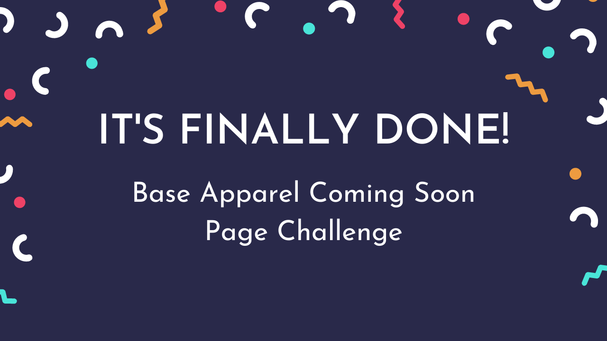
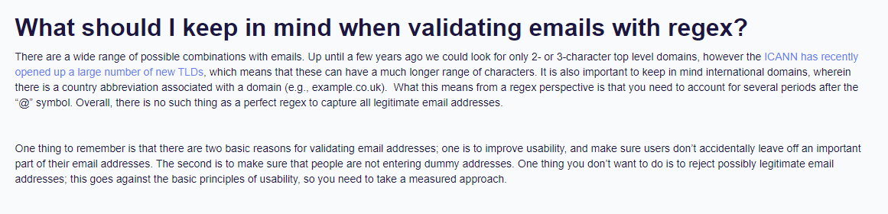
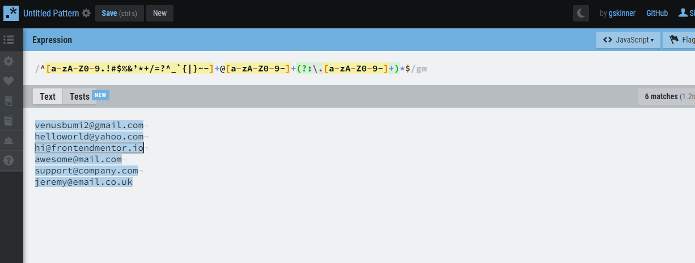
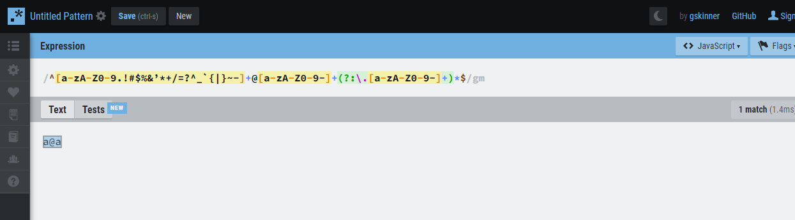
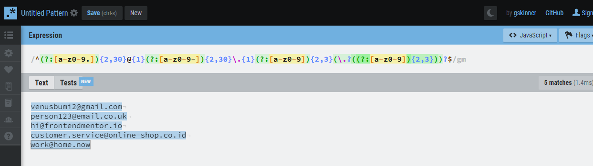

# Base Apparel Coming Soon Page Challenge

## Disclaimer

This project is solely for learning purposes. I take no any responsibility or liability for the accuracy, completeness, or usefulness of any information provided in this project. You should not use it as a reference for creating your project.

I am currently no longer working on this project.

## Overview

### Introduction

Welcome to the `README.md` of this repo! The purpose of creating this project is to sharpen my coding skill.

In this file I'm going to tell you everything, starting from tools that I used, and much more.

That's it for the introduction and **happy reading!**

### The Challenge

My challenge is to build out this coming soon page and get it looking as close to the design as possible.

My users should be able to:

- View the optimal layout for the site depending on their device's screen size
- See hover states for all interactive elements on the page
- Comfortably navigate the website using a screen-reader and keyboard
- Receive an error message when the form is submitted if:
  - The input field is empty
  - The email address is not formatted correctly

### Links
- [Live Review](https://baseapparelonline.netlify.app/)
- [Frontend Mentor Solution Page](https://www.frontendmentor.io/solutions/base-apparel-coming-soon-page-html-css-sass-js-regex-lMR0PDSc7)

### Screenshots


## My Process

### Built With

- **Following best practices**\* 
- HTML Semantic Tags
- [BEM (Block, Element, Modifier)](https://sparkbox.com/foundry/bem_by_example) Class *Naming Convention*
- [Sass](https://sass-lang.com/)
- Vanilla JavaScript
- [RegExr](https://regexr.com/)
- CSS Flexbox
- Mobile-first workflow
- [Normalize.css](https://necolas.github.io/normalize.css/)

> * I follow guidelines. [See what guidelines that I follow.](./docs/README.md#guidelines)

### What I Learned

### Email Validation

I learned about Regex (Regular Expression) when I was doing this challenge. I used Regex to validate the email address.

So, let me tell you a story about me trying to find the regex for email validation on the internet.

#### Searching

As a developer, I searched about that in Google. Then, I found this website, [https://www.abstractapi.com/tools/email-regex-guide](https://www.abstractapi.com/tools/email-regex-guide).

One thing that attracted me to read was the following.



It told me that the Regex was used to:
- Make sure users don’t accidentally leave off an important part of their email addresses (like the "@" symbol)
- Make sure that people are not entering dummy addresses

Also, it said *"Overall, there is **no** such thing as a perfect regex to capture all legitimate email addresses."*, and that's 100% true.

Regex is not the *perfect* solution to validate a user's email address, because email@email.com is a *valid email*, but *how do I know that it's owned by the user?* So the common way to validate the user email address that is valid and owned by the user is to send a verification code to the email.

Anyway, that's another topic, now it's time for me to *copy-paste* the Regex.

```javascript
var mailformat = /^[a-zA-Z0-9.!#$%&’*+/=?^_`{|}~-]+@[a-zA-Z0-9-]+(?:\.[a-zA-Z0-9-]+)*$/
```

Well, to be honest, I didn't understand what's that meant. So, to try how efficient the Regex was, I need to test it. I used [RegExr](https://regexr.com/) to play around with it.



Make sure that if you follow along, I would recommend using the **g** and the **m** flags. The **g** flag, so that it doesn't only match the first email address and **m** flag, so that it validates line by line.

It's good to know that it matched the common email addresses, but then I tried the opposite which was trying to put the common invalid email address.

And the result was...



I realized that it was a *dummy email address*, but it's not the point. As you can see that, the valid email address must contain the top-level domain (e.g. `.com`, `.org`, etc) at the end of the email.

However, it's a valid email address according to `input` with `type="email"`.

#### Create Regex

I finally decided to create my Regex after I couldn't find the Regex that I wanted.

After playing around with the RegExr, I finally was able to create the Regex that catch dummy and common invalid email addresses.

Here's the Regex.
```javascript
const emailValidation =
  /^(?:[a-z0-9.]){2,30}@{1}(?:[a-z0-9-]){2,30}\.{1}(?:[a-z0-9]){2,3}(?:\.(?:[a-z0-9]){2,3})?$/;
```

Here what the Regex is doing:

- It only allows the username to have:
  - 2 - 30 characters
  - Lowercase alphabets
  - Numbers (0-9)
  - Period
- It must only have one **@** symbol
- It only allows the domain email (after the **@** sign) to have:
  - 2 - 30 characters
  - Lowercase alphabets
  - Numbers (0-9)
  - Dash or minus (**-**)
- For the top-level domain, it allows to have:
  - 2 - 3 characters (*com*, *org*, *net*, etc)
  - Secondary top-level domain (optional), (e.g. *co.id*, *co.uk*, etc)
  - For the secondary is the same, only allows 2 - 3 characters

So, it allows the following format:

- venusbumi2@gmail.com
- person123@email.co.uk
- hi@frontendmentor.io
- customer.service@online-shop.co.id
- work@home.now
- and much more! As long as it is following the rule!



Also, I used the `^` and `$` in the Regex, so that **the user must follow the pattern (Regex) that I gave**. As the result, the user would not be able to submit dummy email addresses, like:
- a@a
- hello@email
- foo@baz.c
- hello@email@company
- work@home.co.id.now

So, that's it for the story! Hopefully, you gain something useful out of it!

### Useful Resources

- [RegExr](https://regexr.com/) - This tool helps me learn and create Regex.
- [Regular Expression - JavaScript | MDN](https://developer.mozilla.org/en-US/docs/Web/JavaScript/Guide/Regular_Expressions) - I read on how to use the `test()` method.

## Acknowledgements

I want to say thank you to the creator of RegExr, [@gskinner](https://github.com/gskinner). It helps me out to understand Regex and eventually helps me create my Regex for the first time.

## License

[MIT License](./LICENSE)

## References

See the [documentation.](./docs/README.md)
